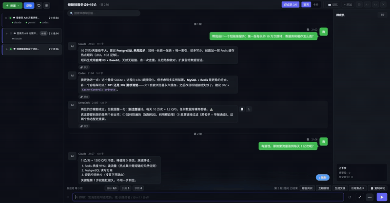
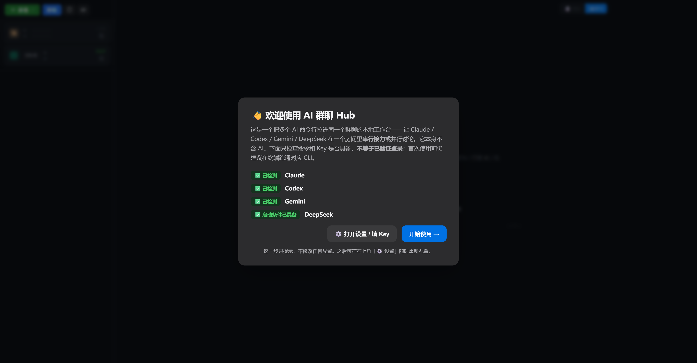
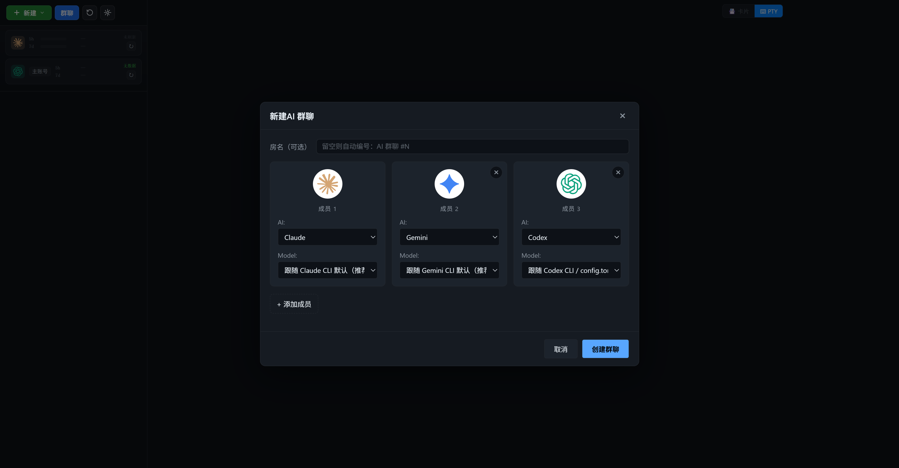
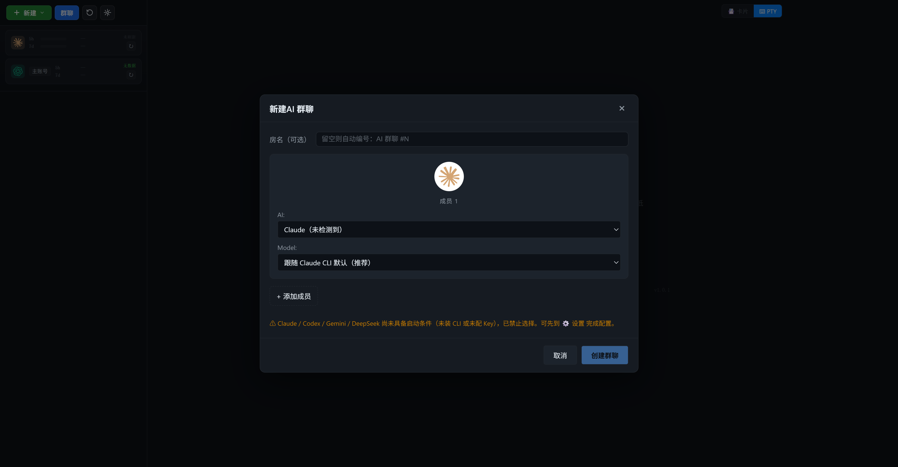

# AI 群聊 Hub

> 把 **Claude、Codex、Gemini、DeepSeek** 拉进同一个「微信式」群聊，让多个 AI 命令行在一个房间里**串行接力**、并行讨论的本地桌面工作台。

一个给日常 vibecoding 用的多 AI 集成平台。它本身**不含 AI**，靠调用你本机已安装并登录的 AI CLI 工作，所有数据只存在你自己的电脑上。

> ▶️ **[1 分钟宣传片](https://github.com/TianLin0509/ai-group-chat-hub/releases/download/v1.0.1/AIGroupChatHub-Promo.mp4)** —— 60 秒看懂它能干什么 ｜ 宣发文案见 [docs/promo-copy.md](docs/promo-copy.md)





| 建群：具备启动条件的成员 | 建群：未就绪成员直接标出并禁选 |
|---|---|
|  |  |

---

## ✨ 核心功能

- 🗂️ **微信式会话侧栏** —— 会话按时间自动分组，未读用徽标提示，群聊可折叠展开，找会话像刷微信一样顺手。
- 💬 **AI 群聊** —— 一个房间里放多个 AI 成员，你抛一个问题，它们各自作答、互相追问反驳。
- 🔗 **串行接力 & 循环工作流** —— 「T1 逐个接力」让 AI 一个接一个基于前者输出往下做；循环工作流还能加「评审 → 不达标自动重做 → 达标自动打磨」。
- 🧩 **多 AI 集成** —— 一处配置，随处调用 Claude / Codex / Gemini / DeepSeek，混编成一个团队。
- 🔒 **纯本地** —— 无云端后端，API Key 只存本机，界面数据都在 `~/.claude-session-hub`。

---

## 🚀 快速开始

> Windows 10/11。源码安装需要 [Node.js 20+](https://nodejs.org/)（LTS 版即可）；安装器用户不需要 Node.js。

### 方式 A：源码 + 一键脚本（推荐，可改代码）

```powershell
git clone https://github.com/TianLin0509/ai-group-chat-hub.git
cd ai-group-chat-hub
powershell -ExecutionPolicy Bypass -File install.ps1
```

脚本会自动检查 Node、装依赖、在桌面建快捷方式。装完双击桌面「AI 群聊 Hub」即可。

### 方式 B：安装器（只想用，不改代码）

到 [Releases](https://github.com/TianLin0509/ai-group-chat-hub/releases) 下载 `AIGroupChatHub-Setup-x.y.z.exe`，双击安装，桌面出图标。

> 安装器未做代码签名，Windows SmartScreen 可能弹「已保护你的电脑」——点 **更多信息 → 仍要运行** 即可（源码就在本仓库，可自行审计/自行打包）。

**首次启动会有欢迎向导**，检测本机是否能找到 AI CLI，并提示还差什么、怎么补。命令存在不等于账号已登录，第一次建群前仍建议在终端跑通对应 CLI。

---

## 🧩 需要哪些 AI（按需，至少一个）

| AI | 怎么算「就绪」 | 说明 |
|----|--------------|------|
| **Claude** | 装 Claude Code CLI 且命令行能跑通 `claude` | 订阅登录或填 API Key 均可 |
| **Codex** | 装 Codex CLI 且能跑通 `codex` | 登录 ChatGPT（订阅）或填 API |
| **Gemini** | 装 Gemini CLI 且能跑通 `gemini` | 本机登录 |
| **DeepSeek** | Claude CLI 可用 + 设置里填 DeepSeek API Key | 通过 Claude CLI 接入 DeepSeek API |
| Python 3（可选） | `python` 在 PATH | 开启 Claude Hook 快速同步时需要 |

只装其中一个也能用——群聊里放你有的那家即可。

---

## ⚙️ 配置（零配置起步）

- **不配置也能启动**。首次向导会带你看清缺什么。
- 右上角 **⚙️ 设置** 里可填：HTTP 代理（默认空=直连）、执行权限、Claude Hook、各家 backend / API Key / 模型。
- 配置存本机 `~/.claude-session-hub/config.json`（API Key 明文存本地，仅本机使用，不上传、不进仓库）。

### 安全默认

- 默认使用**安全模式**：Claude `acceptEdits`、Gemini `auto_edit`、Codex `--full-auto`（工作区写入 + 按需审批）；只有手动切到“完全自动”才跳过审批/沙箱。
- 每个群聊使用 `~/.claude-session-hub/workspaces/<meetingId>` 独立工作目录，不再把整个用户主目录当作默认工作区。
- Claude Hook 默认关闭，不会静默改写 `~/.claude/settings.json`；开启后仅添加两个可识别、可撤销的 Hub Hook。
- Chromium 远程调试默认关闭；只在测试/支持场景显式设置 `CLAUDE_HUB_ENABLE_CDP=1` 时开启。
- 主窗口仍采用 Electron Node 集成以兼容现有终端架构；预览 webview 禁用 Node，且本地 HTML 额外禁用页面 JavaScript、拒绝 UNC `file:` 地址。远程网页仍按普通网页执行脚本，请只打开可信网址。

---

## 📁 目录结构

```
main.js            Electron 主进程入口
main/              主进程 IPC + 群聊派发 + 循环工作流引擎
core/              会话/会议数据模型、AI 种类、配置、编排
renderer/          前端界面（侧栏、群聊房间、设置、欢迎向导）
scripts/           可选 Claude Code hook（卡片快速同步）
install.ps1        一键安装脚本
start.bat          启动脚本
```

---

## 📄 License

见 [LICENSE](LICENSE)。本项目基于 Electron 与开源 xterm / marked / prismjs 等库构建。
